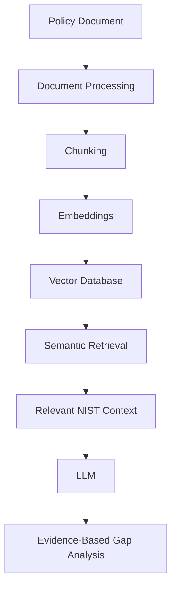

# Policy Gap Analysis RAG

A Retrieval-Augmented Generation (RAG) based cybersecurity policy gap analyzer.

## Objective

This project implements a RAG-based approach for analyzing organizational cybersecurity policies against the NIST Cybersecurity Framework.

This is a separate implementation from my earlier NLP and keyword-matching based Policy Gap Analyzer.

## Architecture

## Tech Stack

- Python
- PyMuPDF
- Sentence Transformers
- ChromaDB
- Streamlit
- LLM

## Project Status

🚧 Under Development

### Progress

- [x] Repository setup
- [x] NIST document ingestion
- [x] Document chunking
- [x] Embeddings
- [x] Vector database
- [ ] Semantic retrieval
- [ ] LLM integration
- [ ] Evidence-based gap analysis
- [ ] Streamlit interface
- [ ] Evaluation against NLP approach
